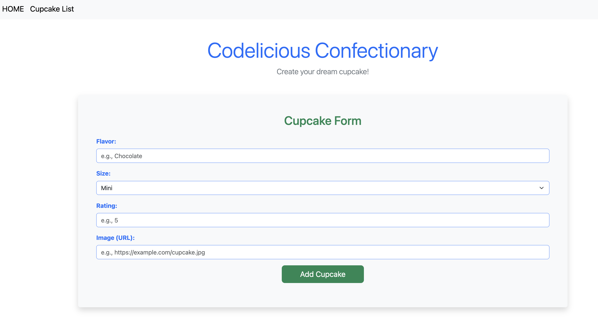

# Flask Cupcakes Exercise

A simple Flask application for managing a collection of cupcakes, built with Flask, SQLAlchemy, and Bootstrap. Users can view, add, and (optionally) delete cupcakes through a responsive interface. The project demonstrates RESTful API design, AJAX form handling, and dynamic UI updates.

This app practices using full-stack web development concepts with Python and JavaScript.

## Table of Contents

- [Overview](#overview)
  - [Features](#features)
  - [Sreenshot](#screenshots)
  - [Links](#links)
- [Built With](#built-with)
- [Getting Started](#getting-started)
  - [Setup Instructions](#setup-instructions)
  - [Continued development](#continued-development)
- [API Endpoints](#api-endpoints)
- [Author](#author)
- [Acknowledgments](#acknowledgments)

---

## Overview

### Features
- View a list of all cupcakes
- Add a new cupcake via AJAX form
- Delete cupcakes dynamically
- Responsive, Bootstrap-styled UI
- RESTful API endpoints for cupcake data

### Screenshots

### Links
- TBD

## Built With
- **Python**: Backend logic and routing.
- **Jinja2**: Python template engine that works with Flask
- **Flask**: Web framework for building the application.
- **SQLAlchemy**: ORM for database management.
- **Bootstrap**: Frontend styling and responsive design.
- **HTML5 & CSS3**: Markup and styling for the UI.
- **JavaScript**: Handles dynamic UI updates and AJAX.
- **jQuery**: Simplifies DOM manipulation and event handling.
- **Axios**: Promise-based HTTP client for AJAX requests.

---

## Getting Started

### Setup Instructions

1. Clone the repository
2. Create and activate a virtual environment
    python3 -m venv venv
    source venv/bin/activate
3. Install Dependencies
    pip install -r requirements.txt
4. Set up the DB 
5. Seed the DB (optional)
    python seed.py
6. Run the Application
    flask run
7. Open the app in your Browser http://127.0.0.1:5000

### Continued development
- This is a basic application and doesn't include features like user authentication, password management
- In the next update I hope to add more features and functionalities

## API Endpoints
- `GET /api/cupcakes` — List all cupcakes
- `POST /api/cupcakes` — Add a new cupcake
- `GET /api/cupcakes/<id>` — Get a specific cupcake
- `PATCH /api/cupcakes/<id>` — Update a cupcake
- `DELETE /api/cupcakes/<id>` — Delete a cupcake

## Author
- Github - [DNel2](https://github.com/TechEdDan2)
- Frontend Mentor - [@TechEdDan2](https://www.frontendmentor.io/profile/TechEdDan2)

## Acknowledgments
The YouTubers and other educational resources I have been learning from include: Coder Coder (Jessica Chan), BringYourOwnLaptop (Daniel Walter Scott), Kevin Powell, Udemy courses, and Bootcamp (Colt Steele)  
